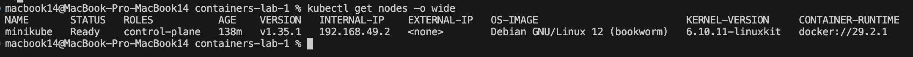
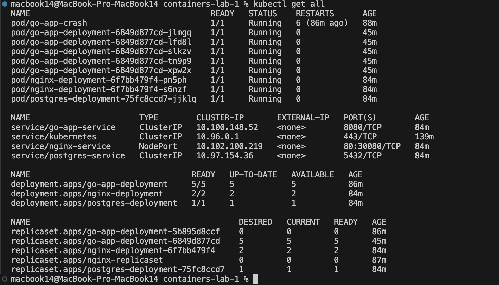
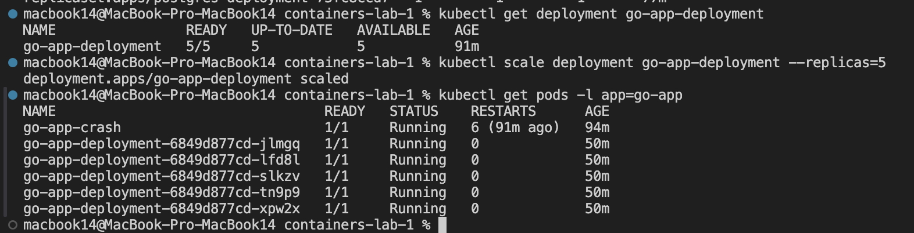
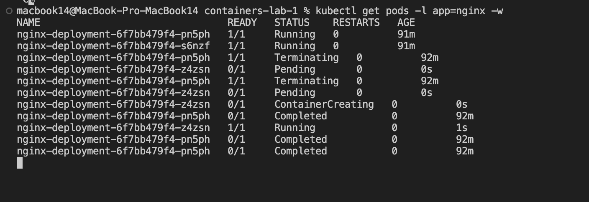
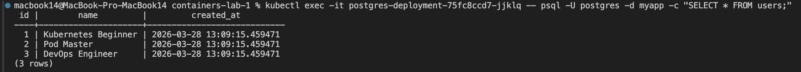
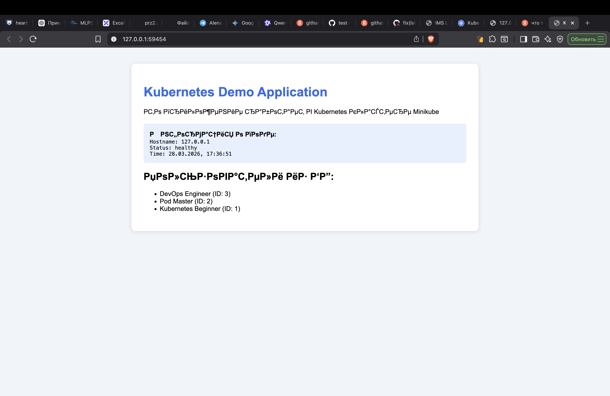
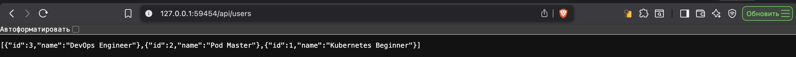
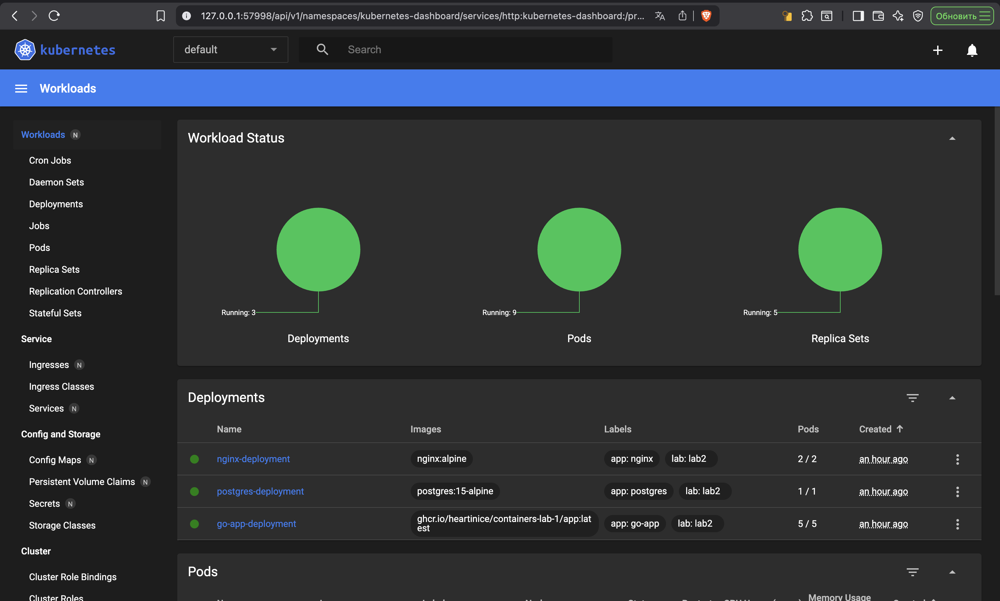

# Отчет по практической работе №2

### Студент: Игнатьева Мария Сергеевна
### Группа: БСБО-16-23
### Дата выполнения: 28.03.2026
### Github: https://github.com/heartinice/containers-lab-1

### 1. Работа с ресурсами Kubernetes

#### 1.1 Информация о кластере и узлах
Мы инициализировали кластер с помощью Minikube и проверили состояние узла.

  

#### 1.2 Развертывание объектов (Pods, Deployments, Services)
Были применены манифесты для создания полной инфраструктуры: Nginx, Go-приложение и PostgreSQL.

   

#### 1.3 Масштабирование и самовосстановление
Проверена работа ReplicaSet: приложение масштабировано до 5 реплик, а также протестировано автоматическое пересоздание пода после его удаления вручную.

  
  

#### 1.4 Проверка базы данных внутри кластера
Прямое подключение к поду базы данных для проверки успешной инициализации таблицы пользователей.

  

### 2. Скриншоты работающего приложения

#### 2.1 Веб-интерфейс (Frontend + Backend)
Главная страница, работающая через NodePort Service.

#### 2.2 Проверка связки App <-> БД
Вывод данных из PostgreSQL через API бэкенда.

#### 2.3 Мониторинг в Dashboard
Визуализация состояния всех ресурсов кластера через стандартную панель управления.

### 4. Выводы
В ходе выполнения практической работы №2 были достигнуты следующие результаты:
* **Изучена архитектура Kubernetes:** Освоены базовые примитивы — Pods (минимальная единица), Deployments (управление версиями и репликацией) и Services (сетевой доступ) .
* **Реализована отказоустойчивость:** Благодаря использованию ReplicaSet и правильно настроенным Liveness/Readiness пробам, система автоматически восстанавливается при сбоях и не направляет трафик на не готовые к работе контейнеры .
* **Управление конфигурациями:** Использование ConfigMap позволило вынести настройки Nginx и SQL-скрипты инициализации БД из образов, сделав инфраструктуру более гибкой .
* **Автоматизация проверок:** Настроен CI-пайплайн для валидации Kubernetes-манифестов (dry-run и kubeval), что минимизирует риск деплоя некорректных конфигураций в кластер .
* **Решена проблема кросс-платформенности:** Для работы на процессоре Apple Silicon была использована локальная сборка образов внутри окружения Minikube, что обеспечило совместимость архитектур .