# Отчет по практической работе №1

### Студент: Игнатьева Мария Сергеевна
### Группа: БСБО-16-23
### Дата выполнения: 12.03.26
### Github: https://github.com/heartinice/containers-lab-1

### 1. Выполненные команды Docker

#### 1.1 Работа с образами

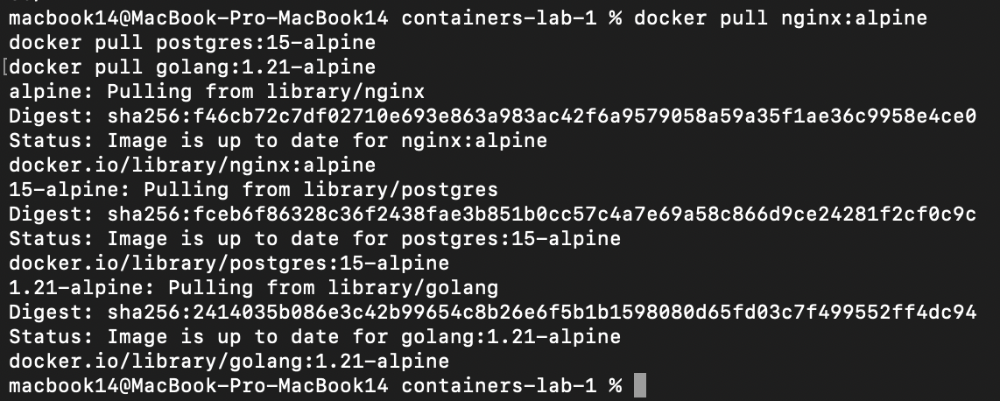  
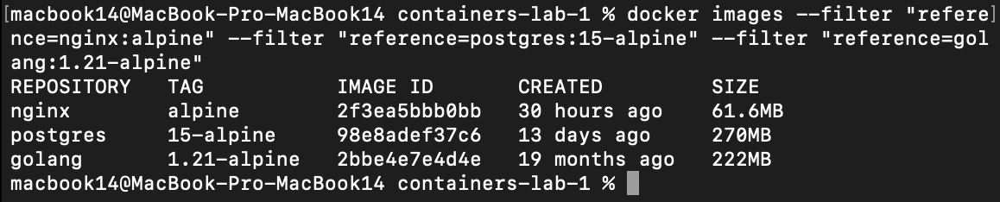   

#### 1.2 Работа с контейнерами

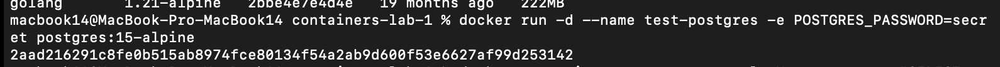  
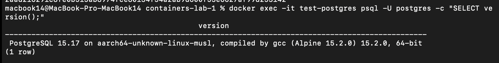  
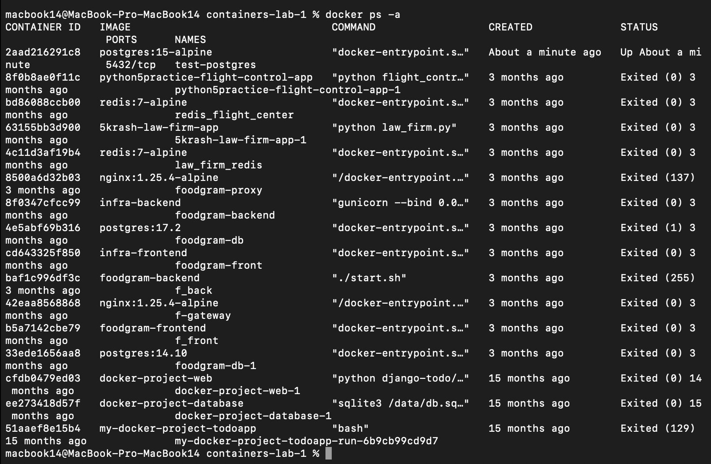  

#### 1.3 Работа с томами

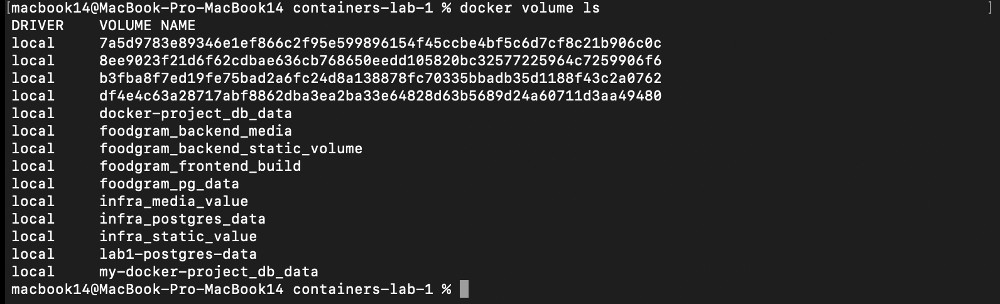  
  
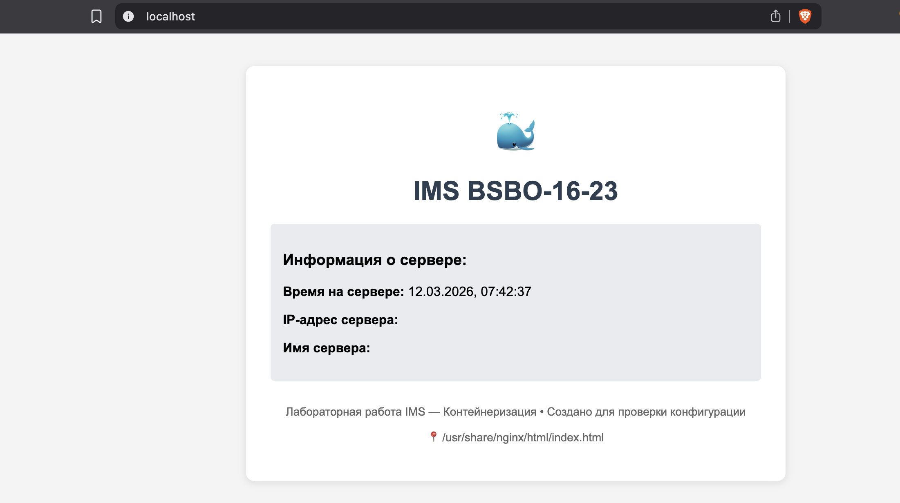  

### 2. Скриншоты работающего приложения

#### 2.1 Главная страница

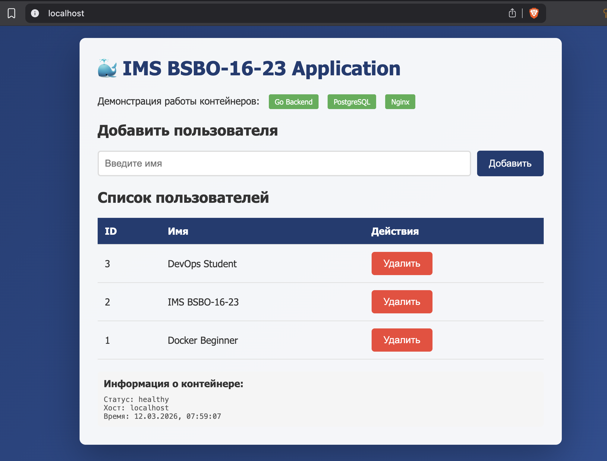

#### 2.2 Список пользователей в БД

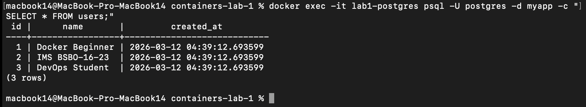

### 3. GitHub Actions

#### 3.1 Успешный запуск workflow

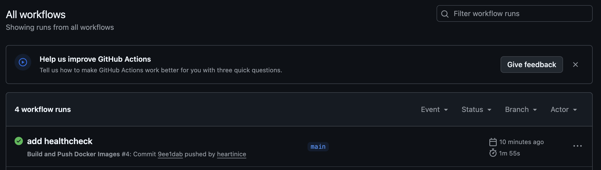

#### 3.2 Опубликованные образы в GHCR

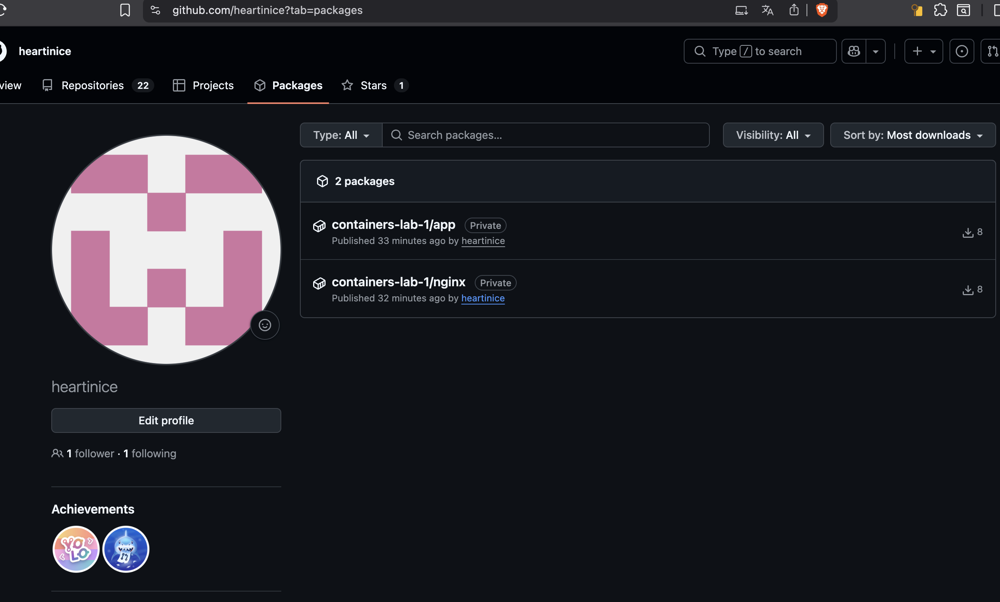

### 4. Выводы
В ходе выполнения практической работы №1 были достигнуты следующие результаты:
* Освоены базовые команды Docker: Я научилась управлять образами (pull, images, rmi), контейнерами (run, ps, exec, logs) и томами (volume create, inspect) .
* Разработаны эффективные Dockerfile: Использование multi-stage сборки позволило разделить процесс компиляции Go-приложения и создание финального легковесного образа на базе Alpine, что значительно оптимизировало размер и безопасность контейнера .
* Настроена оркестрация через Docker Compose: Все три компонента системы PostgreSQL, Go Backend, Nginx были объединены в общую сеть, а данные базы данных надежно защищены от потери с помощью именованных томов .
* Автоматизирован цикл CI/CD: С помощью GitHub Actions был настроен пайплайн, который автоматически собирает образы и публикует их в GitHub Container Registry (GHCR) при каждом пуше в репозиторий.